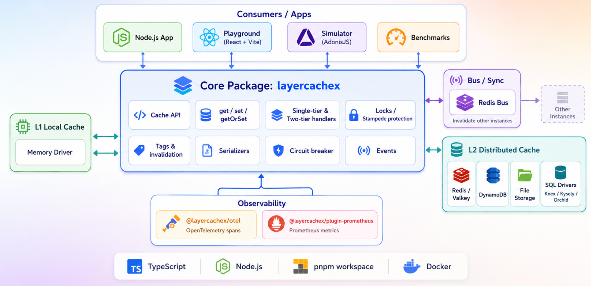
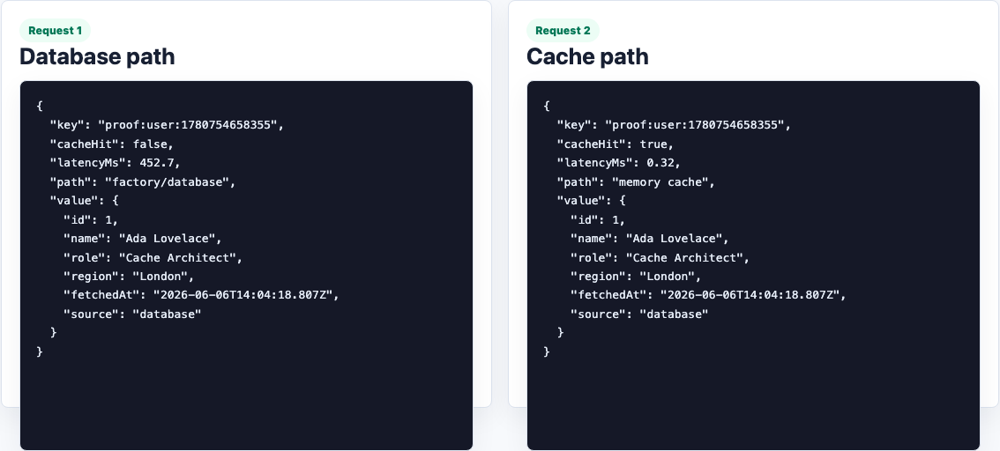
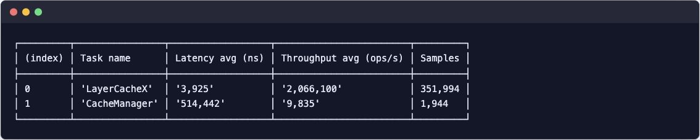

# LayerCacheX

**LayerCacheX** is a TypeScript first multi-tier caching library for Node.js. It lets you combine a fast local **L1 memory cache** with a shared **L2 distributed cache** such as Redis, Valkey, DynamoDB, file storage, PostgreSQL, MySQL, SQLite, or another SQL backend through adapters.

It is designed for high throughput cache reads, graceful stale value fallback, tag based invalidation, cache-stampede protection, and observability through Prometheus and OpenTelemetry.

## Highlights

- **Multi-tier caching:** combine in-memory L1 with Redis/Valkey, DynamoDB, file, or SQL-backed L2 storage.
- **Fast memory-first reads:** serve hot values from local memory before falling back to distributed cache or factory/database work.
- **Grace periods / stale fallback:** return an expired-but-safe value while refreshing in the background or when a factory fails.
- **Cache-stampede protection:** per-key locks prevent many concurrent factory executions for the same missing key.
- **Cross-instance invalidation:** Redis bus support keeps local L1 caches synchronized across multiple app instances.
- **Tag-based invalidation:** attach tags to cache entries and invalidate groups with `deleteByTag`.
- **Fault tolerance:** optional L2 circuit breaker and L2 error suppression when an L1 backup is available.
- **Observability:** emits cache events, Prometheus metrics, and OpenTelemetry spans.
- **Monorepo packages:** core cache library, Prometheus plugin, OpenTelemetry instrumentation, playground, simulator, and benchmarks.

## Preview





## Project Structure

```text
LayerCacheX/
├── .changeset/
│   └── config.json
├── .github/
│   ├── lock.yml
│   ├── stale.yml
│   └── workflows/
│       ├── checks.yml
│       └── stale.yml
├── benchmarks/
│   ├── all.ts
│   ├── helpers.ts
│   ├── memory_get_or_set.ts
│   ├── mtier_get_key.ts
│   ├── mtier_get_or_set.ts
│   ├── mtier_set_key.ts
│   ├── onetier_get_key.ts
│   ├── onetier_set_key.ts
│   └── package.json
├── docker/
│   └── prometheus.yml
├── images/
│   ├── layercachex-benchmark.png
│   ├── layercachex-cache-proof.png
│   └── layercachex_architecture.png
├── packages/
│   ├── layercachex/
│   │   ├── bin/
│   │   ├── factories/
│   │   ├── src/
│   │   │   ├── bus/
│   │   │   ├── cache/
│   │   │   ├── circuit_breaker/
│   │   │   ├── drivers/
│   │   │   ├── events/
│   │   │   ├── serializers/
│   │   │   ├── types/
│   │   │   ├── utils/
│   │   │   ├── errors.ts
│   │   │   ├── helpers.ts
│   │   │   ├── layer_cache_x.ts
│   │   │   ├── layer_cache_x_options.ts
│   │   │   ├── layer_store.ts
│   │   │   ├── logger.ts
│   │   │   ├── test_suite.ts
│   │   │   └── tracing_channels.ts
│   │   ├── tests/
│   │   ├── index.ts
│   │   ├── package.json
│   │   ├── tsconfig.json
│   │   └── tsup.config.ts
│   ├── otel/
│   │   ├── bin/
│   │   ├── src/
│   │   ├── tests/
│   │   ├── index.ts
│   │   ├── package.json
│   │   └── tsconfig.json
│   └── prometheus/
│       ├── bin/
│       ├── dashboards/
│       ├── src/
│       ├── tests/
│       ├── index.ts
│       ├── package.json
│       └── tsconfig.json
├── playground/
│   ├── src/
│   │   ├── cache.ts
│   │   └── index.tsx
│   ├── package.json
│   └── tsconfig.json
├── simulator/
│   ├── app/
│   ├── bin/
│   ├── config/
│   ├── inertia/
│   ├── start/
│   ├── ace.js
│   ├── adonisrc.ts
│   ├── package.json
│   ├── tsconfig.json
│   ├── uno.config.ts
│   └── vite.config.ts
├── .gitignore
├── compose.yml
├── eslint.config.js
├── License
├── package.json
├── pnpm-lock.yaml
├── pnpm-workspace.yaml
├── README.md
└── tsconfig.json
```

## Tech Stack

| Category | Technology |
|---|---|
| Language | TypeScript |
| Runtime | Node.js |
| Package Manager | pnpm |
| Monorepo | pnpm Workspace |
| Core Library | LayerCacheX |
| Cache Drivers | Redis, In-Memory, File, DynamoDB, Database |
| Database Adapters | Knex, Kysely, Orchid ORM |
| Backend Framework | AdonisJS |
| Frontend | Vue 3, Inertia.js |
| UI Library | PrimeVue |
| Build Tool | tsup, Vite |
| Testing | Japa, c8, Testcontainers |
| Observability | OpenTelemetry, Prometheus |
| Logging | Pino |
| Containerization | Docker Compose |
| Code Quality | ESLint, Prettier |
| Release Management | Changesets, release-it |

## Packages

| Package | Purpose |
| --- | --- |
| `layercachex` | Core caching library and drivers. |
| `@layercachex/plugin-prometheus` | Prometheus metrics plugin for LayerCacheX events. |
| `@layercachex/otel` | OpenTelemetry instrumentation for LayerCacheX operations. |
| `@layercachex/playground` | Hono-based local showcase app. |
| `@layercachex/benchmarks` | Tinybench benchmark scripts. |
| `simulator` | AdonisJS + Vue/Inertia simulator for multi-node cache behavior. |

## Requirements

- Node.js `>=18.16.0`
- pnpm, managed through Corepack
- Docker, only for Redis/Valkey/DynamoDB/Postgres/MySQL local integration tests or demos

The repo is configured as an ESM TypeScript pnpm workspace.

## Installation

For package consumers:

```bash
pnpm add layercachex
```

Install optional peer dependencies only for the drivers you use:

```bash
# Redis / Valkey driver and Redis bus
pnpm add ioredis

# DynamoDB driver
pnpm add @aws-sdk/client-dynamodb

# SQL database driver options
pnpm add knex pg
pnpm add kysely mysql2
pnpm add orchid-orm
```

For this monorepo:

```bash
corepack enable
corepack prepare pnpm@10.33.0 --activate
pnpm install
pnpm build
```

## Quick Start

### 1. Memory-only cache

```ts
import { LayerCacheX, layerstore } from 'layercachex'
import { memoryDriver } from 'layercachex/drivers/memory'

const cache = new LayerCacheX({
  default: 'default',
  ttl: '30m',
  stores: {
    default: layerstore().useL1Layer(
      memoryDriver({
        maxItems: 10_000,
        serialize: true,
      }),
    ),
  },
})

await cache.set({
  key: 'user:1',
  value: { id: 1, name: 'Ada Lovelace' },
  ttl: '5m',
  tags: ['users'],
})

const user = await cache.get({ key: 'user:1' })
```

### 2. Memory + Redis two-tier cache

```ts
import { LayerCacheX, layerstore } from 'layercachex'
import { memoryDriver } from 'layercachex/drivers/memory'
import { redisDriver, redisBusDriver } from 'layercachex/drivers/redis'

const cache = new LayerCacheX({
  default: 'primary',
  prefix: 'my-app',
  ttl: '30m',
  grace: '2h',
  l2CircuitBreakerDuration: '30s',
  stores: {
    primary: layerstore()
      .useL1Layer(memoryDriver({ maxItems: 5_000 }))
      .useL2Layer(
        redisDriver({
          connection: { host: 'localhost', port: 6379 },
        }),
      )
      .useBus(
        redisBusDriver({
          connection: { host: 'localhost', port: 6379 },
        }),
      ),
  },
})
```

### 3. `getOrSet` with TTL, grace, and tags

```ts
const post = await cache.getOrSet({
  key: 'post:42',
  ttl: '45s',
  grace: '5m',
  tags: ['posts', 'homepage'],
  factory: async (ctx) => {
    const post = await database.posts.findById(42)

    if (!post) {
      ctx.fail('Post not found')
    }

    // The factory can adjust options dynamically.
    ctx.setOptions({ ttl: '10m' })

    return post
  },
})
```

### 4. Tag invalidation

```ts
await cache.set({
  key: 'user:1',
  value: { id: 1, name: 'Ada' },
  tags: ['users'],
})

await cache.deleteByTag({ tags: ['users'] })
```

### 5. Namespaces

```ts
const tenantCache = cache.namespace('tenant:acme')

await tenantCache.set({ key: 'settings', value: { theme: 'dark' } })
const settings = await tenantCache.get({ key: 'settings' })
```

## Core API

| Method | Description |
| --- | --- |
| `use(storeName?)` | Select a configured store. Defaults to the configured default store. |
| `get({ key, defaultValue? })` | Read a value, optionally returning a fallback. |
| `set({ key, value, ttl?, tags? })` | Store a value for the configured TTL. |
| `setForever({ key, value })` | Store a value without TTL expiration. |
| `getOrSet({ key, factory, ttl?, grace? })` | Read from cache or run a factory and cache the result. |
| `getOrSetForever({ key, factory })` | `getOrSet` without TTL expiration. |
| `has({ key })` | Check whether a valid value exists. |
| `missing({ key })` | Opposite of `has`. |
| `pull(key)` | Read and delete a value. |
| `delete({ key })` | Delete one key. |
| `deleteMany({ keys })` | Delete multiple keys. |
| `deleteByTag({ tags })` | Invalidate all cache entries associated with tags. |
| `expire({ key })` | Logically expire a key while keeping it available for grace fallback. |
| `clear()` | Clear the selected store. |
| `clearAll()` | Clear all configured stores. |
| `prune()` | Manually prune expired entries for drivers that need pruning. |
| `namespace(name)` | Return a namespaced cache provider. |
| `disconnect()` | Close the default store connection. |
| `disconnectAll()` | Close all created store connections. |

## Configuration Options

LayerCacheX supports options at three levels:

1. **Global options** on `new LayerCacheX(...)`
2. **Store options** on `layerstore({ ... })`
3. **Operation options** on `getOrSet`, `set`, `get`, `delete`, etc.

Common options:

| Option | Description | Typical value |
| --- | --- | --- |
| `prefix` | Prefix applied to stored cache keys. | `'my-app'` |
| `ttl` | Logical TTL for cache entries. | `'30m'`, `'5s'`, `60000` |
| `grace` | Stale-value grace period. Set `false` to disable. | `'2h'` |
| `graceBackoff` | Adds time to a graced entry after factory failure. | `'10s'` |
| `timeout` | Soft timeout before returning a graced value. `0` enables SWR-style immediate fallback. | `0`, `'200ms'` |
| `hardTimeout` | Hard factory timeout that throws if reached. | `'2s'` |
| `lockTimeout` | Maximum time to wait for a per-key factory lock. | `'500ms'` |
| `forceFresh` | Force factory execution even if a cache value exists. | `true` |
| `tags` | Tags attached to the cache entry. | `['users']` |
| `skipL2Write` | Skip writing a value to L2 for one operation. | `true` |
| `skipBusNotify` | Skip bus invalidation notification for one operation. | `true` |
| `suppressL2Errors` | Suppress remote cache errors and use fallback behavior. | `true` |
| `l2CircuitBreakerDuration` | Temporarily stop calling failing L2 cache. | `'30s'` |
| `logger` | Logger compatible with Pino-style methods. | `pino(...)` |
| `emitter` | Event emitter compatible with Node `EventEmitter` or Emittery. | `new EventEmitter()` |
| `serializer` | Custom cache value serializer. | `{ serialize, deserialize }` |

## Drivers

| Driver | Import | Layer | Notes |
| --- | --- | --- | --- |
| Memory | `layercachex/drivers/memory` | L1 | Uses `lru-cache`; supports `maxItems`, `maxSize`, and `maxEntrySize`. |
| Redis / Valkey | `layercachex/drivers/redis` | L2 | Uses `ioredis`; supports single Redis or cluster connections. |
| Redis Bus | `layercachex/drivers/redis` | Bus | Publishes cache invalidation messages between app instances. |
| File | `layercachex/drivers/file` | L2 | Stores entries as files; supports pruning expired entries. |
| DynamoDB | `layercachex/drivers/dynamodb` | L2 | Uses AWS SDK DynamoDB client. |
| SQL Database | `layercachex/drivers/database` | L2 | Generic database driver used by adapters. |
| Knex adapter | `layercachex/drivers/knex` | L2 | Works with Knex and underlying DB packages. |
| Kysely adapter | `layercachex/drivers/kysely` | L2 | Works with Kysely and supported dialects. |
| Orchid adapter | `layercachex/drivers/orchid` | L2 | Works with Orchid ORM. |

### File driver example

```ts
import { LayerCacheX, layerstore } from 'layercachex'
import { fileDriver } from 'layercachex/drivers/file'

const cache = new LayerCacheX({
  default: 'files',
  stores: {
    files: layerstore().useL2Layer(
      fileDriver({
        directory: './tmp/cache',
        pruneInterval: '1m',
      }),
    ),
  },
})
```

### DynamoDB driver example

```ts
import { LayerCacheX, layerstore } from 'layercachex'
import { dynamoDbDriver } from 'layercachex/drivers/dynamodb'

const cache = new LayerCacheX({
  default: 'dynamodb',
  stores: {
    dynamodb: layerstore().useL2Layer(
      dynamoDbDriver({
        table: { name: 'cache' },
        region: 'us-east-1',
        endpoint: 'http://localhost:8000',
      }),
    ),
  },
})
```

## Events

LayerCacheX emits events that can be used for logging, analytics, or custom plugins.

```ts
cache.on('cache:hit', (event) => {
  console.log('hit', event.key, event.layer)
})

cache.on('cache:miss', (event) => {
  console.log('miss', event.key)
})

cache.on('cache:written', (event) => {
  console.log('written', event.key)
})
```

Available event names include:

- `cache:cleared`
- `cache:deleted`
- `cache:hit`
- `cache:miss`
- `cache:expire`
- `cache:written`
- `bus:message:published`
- `bus:message:received`

## Prometheus Metrics

Install the Prometheus plugin package and `prom-client`:

```bash
pnpm add @layercachex/plugin-prometheus prom-client
```

Register the plugin:

```ts
import { register } from 'prom-client'
import { LayerCacheX, layerstore } from 'layercachex'
import { memoryDriver } from 'layercachex/drivers/memory'
import { prometheusPlugin } from '@layercachex/plugin-prometheus'

const cache = new LayerCacheX({
  default: 'memory',
  plugins: [
    prometheusPlugin({
      prefix: 'layercachex',
      keyGroups: [[/^user:/, 'users']],
    }),
  ],
  stores: {
    memory: layerstore().useL1Layer(memoryDriver()),
  },
})

// Expose this from your HTTP server.
const metrics = await register.metrics()
```

The plugin tracks hits, graced hits, misses, writes, deletes, clears, and bus messages.

## OpenTelemetry

Install the instrumentation package:

```bash
pnpm add @layercachex/otel
```

Example registration:

```ts
import { LayerCacheXInstrumentation } from '@layercachex/otel'

const instrumentation = new LayerCacheXInstrumentation({
  requireParentSpan: true,
  includeKeys: false,
  spanNamePrefix: 'cache',
})

instrumentation.enable()
```

The instrumentation uses LayerCacheX diagnostic channels and can create spans for operations such as `get`, `set`, `getOrSet`, `delete`, `deleteMany`, `clear`, and factory execution.

## Local Development

### Start infrastructure

```bash
# Redis, Valkey, DynamoDB, Postgres, MySQL, Grafana LGTM, Redis Insight
# Start only what you need for your task.
docker compose up -d redis valkey dynamodb postgres mysql

# Optional Redis/Valkey cluster profile
docker compose --profile cluster up -d
```

Useful local ports:

| Service | Port |
| --- | --- |
| Redis | `6379` |
| Valkey | `6380` |
| DynamoDB Local | `8000` |
| PostgreSQL | `5432` |
| MySQL | `3306` |
| Redis Insight | `5540` |
| Grafana LGTM | `3001` |
| OTLP gRPC | `4317` |
| OTLP HTTP | `4318` |
| Prometheus | `9090` |

### Build, typecheck, lint, and test

```bash
pnpm build
pnpm typecheck
pnpm lint
pnpm test
```

### Run the playground

The playground is a Hono app that demonstrates cache hits, tag invalidation, metrics, and benchmark-style output.

```bash
pnpm -C playground dev
```

Open:

- `http://localhost:3042` — showcase UI
- `http://localhost:3042/api/cache-demo` — JSON cache demo
- `http://localhost:3042/cache-proof` — first request database path vs second request cache path
- `http://localhost:3042/metrics` — Prometheus metrics
- `http://localhost:3042/benchmark-output` — benchmark table

<p align="center">
  
</p>

### Run benchmarks

```bash
pnpm -C benchmarks bench:all
```

<p align="center">
  
</p>

### Run the simulator

The simulator is an AdonisJS + Vue/Inertia app that creates multiple cache nodes and lets you test bus and L2 failure behavior.

```bash
cp simulator/.env.example simulator/.env
pnpm -C simulator dev
```

Default simulator URL:

```text
http://localhost:3333
```

## Scripts

Root scripts:

| Command | Description |
| --- | --- |
| `pnpm build` | Build all packages. |
| `pnpm typecheck` | Typecheck all workspace packages. |
| `pnpm lint` | Run ESLint across the repo. |
| `pnpm checks` | Run lint and typecheck. |
| `pnpm test` | Run tests across workspace packages. |

Package-specific examples:

```bash
pnpm -C packages/layercachex test
pnpm -C packages/layercachex build
pnpm -C playground dev
pnpm -C benchmarks bench:all
pnpm -C simulator dev
```

## How LayerCacheX Resolves a `getOrSet`

1. Check L1 memory cache.
2. If L1 misses, check L2 distributed cache.
3. If L2 hits, hydrate L1 and return the value.
4. If both miss, acquire a per-key lock.
5. Run the factory once.
6. Store the result in cache layers.
7. Notify other instances through the bus when configured.
8. Return the value.

When `grace` is enabled, an expired entry can still be returned while the factory refreshes it or when the factory fails. This helps keep applications responsive during slow database calls or temporary backend outages.
